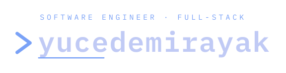

  <picture>
    <source media="(prefers-color-scheme: dark)" srcset="./assets/header-dark.svg" />
    <source media="(prefers-color-scheme: light)" srcset="./assets/header-light.svg" />
    
  </picture>

  

 

<h2 align="center">Contact</h2>

  
  &nbsp;
  
  &nbsp;
  

 

<h2 align="center">About</h2>

A **full-stack software engineer**. What I'm best at is solving problems the pragmatic, engineering way — fast, and in a shape that stays manageable and maintainable. Right now I build a **LIMS** (Laboratory Information Management System) and work with **medical-imaging AI**. I'm relentlessly curious about how things work beneath the surface: I rarely just *use* a tool — I take it apart until I understand it. On the side, I self-host and tinker with infrastructure.

 

<h2 align="center">Tech Stack</h2>

<b>LANGUAGES</b> 

<b>FRONTEND &amp; MOBILE</b> 

<code>+7 more</code>

<b>BACKEND</b> 

<code>+4 more</code>

<b>DATABASES &amp; ORM</b> 

<code>+5 more</code>

<b>ML &amp; DATA SCIENCE</b> 

<code>+7 more</code>

<b>MEDICAL IMAGING</b> 

<b>INFRA &amp; DEVOPS</b> 

<code>+3 more</code>

<b>OS &amp; TOOLING</b> 

<code>+4 more</code>

<b>HARDWARE</b> 

<b>🌱 CURRENTLY LEARNING</b> 

